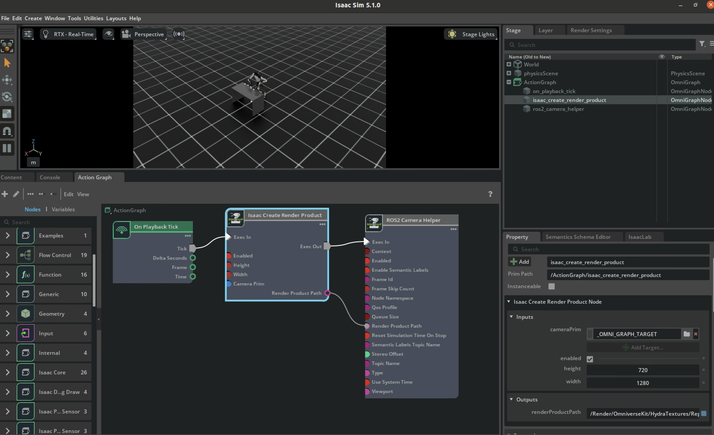

<div align="center">

  # Gearbox Assembly by Galaxea R1
  
  Robotic Collaborative Assembling Challenge (RoCo Challenge) - HMI Workshop @ AAAI 2026 

  [](https://docs.isaacsim.omniverse.nvidia.com/latest/index.html)
  [](https://docs.isaacsim.omniverse.nvidia.com/latest/isaac_lab_tutorials/index.html)
  [](https://docs.python.org/3/whatsnew/3.11.html)

</div>


[RoCo Challenge@AAAI 2026](https://rocochallenge.github.io/RoCo2026/doc.html)


https://github.com/user-attachments/assets/25673b1a-7499-461b-abfd-b341789ee4e2

--- 

# 🚀 Quick Start on Docker

0. Install [Docker](https://docs.docker.com/desktop/setup/install/linux/), [Docker Compose](https://docs.docker.com/compose/install/linux/#install-using-the-repository), and [NVIDIA Container Toolkit](https://docs.nvidia.com/datacenter/cloud-native/container-toolkit/latest/install-guide.html)

1. Git clone

```bash
git lfs install
git lfs pull

git clone https://github.com/wontothree/galaxea-gearbox-assembly.git
```

2. Create the Docker container and run the container

```bash
cd galaxea-gearbox-assembly
./docker/container.py start base
./docker/container.py enter base
```

3. Install dependencies

```bash
cd /workspace/isaaclab/source/gearboxAssembly
python -m pip install -e source/Galaxea_Lab_External
```

4. Run the Policy in the IsaacLab

```bash
cd /workspace/isaaclab/source/gearboxAssembly
python scripts/rule_based_agent.py --task=Template-Galaxea-Lab-External-Direct-v0 --enable_cameras --device cpu
```

# 🚀 Getting Started

### [Docker 1] Isaac Lab (Ubuntu 24.04, ROS2 Jazzy): Simulation Environment and Agent

1. Create the container or run the container

```bash
cd galaxe1-gearbox-assembly
./docker/container.py start ros2 # --suffix [container_name]
# or
./docker/container.py enter ros2 # --suffix [container_name]
```

Check out the ROS

```bash
ros2 topic list
```

2. Install dependencies

```bash
cd /galaxea-gearbox-assembly/source/gearboxAssembly
python -m pip install -e source/Galaxea_Lab_External
```

3. Run the simulation

```bash
cd source/gearboxAssembly
python scripts/rule_based_agent.py --task=Template-Galaxea-Lab-External-Direct-v0 --enable_cameras --device cpu
```

4. Set `Extensions` up in Isaac Sim

`Window` -> `Extensions`

- OMNIGRAPH ACTION GRAPH EDITOR: `ENABLED` & `AUTOLOAD`
- OMNIGRAPH ACTION GRAPH: `ENABLED` & `AUTOLOAD`
- ROS 2 BRIDGE: `ENABLED` & `AUTOLOAD`

5. Connect the Action Graph

`Window` -> `Graph Editors` -> `Action Graph`

Node `On Playback Trick` -> Node `Isaac Create Render Product` -> Node `ROS2 Camera Helper
`


6. Publish the topics

- Click the node `Isaac Create Render Product`
- `Inputs` > `cameraPrim` > click `/World/envs/env_0/Robot/zed_link/head_cam/head_cam` in the drag drop
- Play

7. Check the topic list out

In the other terminal,

```bash
cd galaxea-gearbox-assembly
./docker/container.py enter ros2 

source /opt/ros/jazzy/setup.bash
ros2 topic list
```

### [Docker 2] Isaac ROS (Ubuntu 24.04, ROS2 Jazzy): Foundation Pose

1. Build the Docker image of Isaac ROS and run the container

```bash
cd galaxea-gearbox-assembly/isaac_ros_docker
docker build -t isaac_ros .
./run.sh
```

2. Open the additional window on the same container

```bash
./run.sh
```

3. Setup environment

```bash
source ${ISAAC_ROS_WS}/setup_env.sh
```

4. Kill
```bash
./kill.sh
```

# Execution

- Task 1

```bash
python scripts/jensen_lovers_agent.py --task=Template-Galaxea-Lab-External-Direct-v0 --enable_cameras --num_envs=1 --device cpu
```

- Task 2

```bash
python scripts/jensen_lovers_agent.py --task=Gearbox-Partial-Lackfourth --enable_cameras --num_envs=1 --device cpu
```

- Task 3

```bash
python scripts/jensen_lovers_agent.py --task=Gearbox-Recovery-Misplacedfourth --enable_cameras --num_envs=1 --device cpu
```

Train

```bash
python scripts/rl_games/train.py --task=Galaxea-Planetary-Gear-Assembly-v0 --enable_camera --num_envs=1 --device cpu
```

```bash
python scripts/rule_based_agent.py --task=Galaxea-Planetary-Gear-Assembly-v0 --enable_camera --device cpu
python scripts/rl_games/train.py --task=Template-Galaxea-Lab-External-Direct-v0 --enable_camera --num_envs=1
```

This project is tested in the environment of Docker, Ubuntu 24.04, and Window 11.

---

# Memo

```bash
scripts/rule_based_agent.py # ros dependency
scripts/jensen_lovers_agent.py # no ros dependency
```